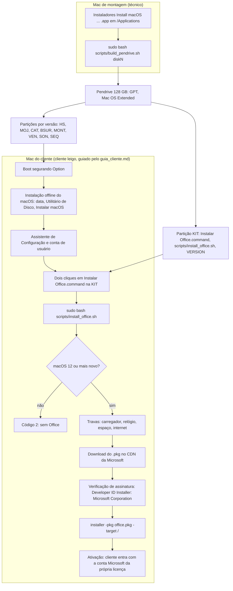

# Visão geral do projeto — para novos colaboradores

Oct 3, 2026 · documento de entrada; os detalhes ficam nos documentos linkados.

## 1. Resumo

- **O que é:** o "Kit Autonomia Mac" da E.C.H.O Tech: um pendrive que reinstala o macOS **offline** em MacBooks Intel (≤2019) e um lançador que instala o Microsoft Office baixado da Microsoft.
- **Para quem:** um cliente leigo que formata vários MacBooks e hoje paga terceiros a cada vez ([briefing, seção 4](briefing.md)).
- **Quem opera:** o técnico monta o pendrive num Mac de montagem; o cliente usa o pendrive sozinho, seguindo o [guia](guia_cliente.md).
- **Estado (03/10/2026):** código e documentação da v0.1 prontos. Validados só por análise estática (`bash -n`, `shellcheck`) e com ferramentas do macOS simuladas. **Nada rodou num Mac real.**
- **Próximo passo:** piloto assistido nos Macs do primeiro cliente, começando pela Fase 0 do [roteiro](roteiro_piloto.md) (inventário).

## 2. O problema

Um MacBook Intel que "trava no Wi-Fi" ao formatar quase nunca tem defeito no Wi-Fi. Ele caiu no **Internet Recovery**, que depende 100% da rede, e a etapa online falha ([briefing, seção 1](briefing.md)).

Isso acontece quando o **Recovery local** foi apagado ou corrompido (por exemplo, numa formatação anterior que apagou o disco inteiro). Sem ele, o Mac baixa o ambiente de recuperação e o instalador pela internet.

Causas-raiz, resumidas do briefing (em ordem de frequência):

| # | Causa | Efeito |
| --- | --- | --- |
| 1 | Recovery local inexistente | O Mac depende da rede para tudo |
| 2 | Relógio errado (bateria arriada, NVRAM zerada) | Certificados parecem inválidos; "cópia danificada" |
| 3 | Rede incompatível (WPA3, só 5 GHz, portal cativo, 802.1X) | Não conecta ou cai no meio |
| 4 | Download grande (12 GB ou mais) em conexão fraca | Barra parada por horas |
| 5 | Instalador antigo com certificado vencido | "Esta cópia ... está danificada" |
| 6 | Chip T2 (2018–2019): ativação online, Bloqueio de Ativação, boot externo bloqueado | Fica na tela de ativação; pendrive não aparece |
| 7 | Hardware degradado (disco, cabo flat, RAM) | Reinicia ou congela em pontos aleatórios |

**Por que a solução é o pendrive offline:** o instalador já está no pendrive, o que resolve as causas 1 e 4 e tira a rede do caminho da instalação (causa 3). A data (causa 2) é corrigida no Terminal antes de instalar. O T2 (causa 6) exige um preparo de segurança **antes** de apagar o disco. Bloqueio de Ativação e senha de firmware não se resolvem: o atendimento para.

## 3. O produto

O cliente recebe ([ADR-003](decisoes.md)):

1. **Um pendrive de 128 GB** com uma partição por versão do macOS (High Sierra → Sequoia) e uma partição `KIT`.
2. **A partição `KIT`** com o lançador `Instalar Office.command`, o `scripts/install_office.sh` e um arquivo `VERSION`.
3. **O [guia do cliente](guia_cliente.md)**, passo a passo, no formato "Faça / Você vê / Se não vir".

O briefing também descreve pacotes comerciais (sessão remota, suporte por WhatsApp, Kit Lite etc.). Os preços ali são **faixas a validar**.

**Quem opera é o cliente leigo** ([ADR-002](decisoes.md)): nada de comandos de Terminal para ele. A única exceção prevista no guia é digitar `date` no Terminal do instalador para acertar o relógio (passo 5).

**O que o Office cobre** ([ADR-001](decisoes.md)):

- Só **macOS 12 (Monterey) ou mais novo**, ou seja, Macs de 2015 em diante (o MacBook 12" de 2015 fica de fora).
- O Office **não vai no pendrive**: é baixado da Microsoft na hora. Precisa de internet e da **licença do próprio cliente**.
- Em macOS 10.13–11 o script sai com código 2 e não instala nada.

## 4. Como o sistema funciona, de ponta a ponta



Em palavras:

1. O técnico baixa os instaladores do macOS no **Mac de montagem** (`softwareupdate` ou App Store, [briefing, seção 3](briefing.md)).
2. `build_pendrive.sh` apaga o pendrive, cria as partições, grava cada instalador com `createinstallmedia` e copia os arquivos do cliente para a `KIT`.
3. O cliente liga o Mac segurando **Option**, escolhe o instalador da versão certa e instala sem rede (Rota A).
4. Já no macOS instalado, com internet, ele dá dois cliques em `Instalar Office.command`. O lançador chama `install_office.sh` com `sudo`.
5. O script escolhe o instalador pela versão do macOS, baixa, confere a assinatura, instala e confere os apps. A ativação é feita pelo cliente no Word.

## 5. Layout do pendrive

Criado por `diskutil partitionDisk ... GPT` em `scripts/build_pendrive.sh:104-108`, todas as partições em `JHFS+` (Mac OS Extended, Journaled). A ordem abaixo é a ordem no disco.

| Partição | Tamanho | Conteúdo depois da gravação |
| --- | --- | --- |
| `HS` | 8G | Install macOS High Sierra |
| `MOJ` | 8G | Install macOS Mojave |
| `CAT` | 10G | Install macOS Catalina |
| `BSUR` | 15G | Install macOS Big Sur |
| `MONT` | 15G | Install macOS Monterey |
| `VEN` | 15G | Install macOS Ventura |
| `SON` | 16G | Install macOS Sonoma |
| `KIT` | 10G | `Instalar Office.command`, `scripts/install_office.sh`, `VERSION` |
| `SEQ` | resto do disco (`R`) | Install macOS Sequoia |

- Cada partição gravada é renomeada pelo `createinstallmedia` para `Install macOS <versão>`; a `KIT` mantém o nome (`scripts/build_pendrive.sh:150`).
- Versão sem instalador em `/Applications` gera uma **partição vazia** e entra como "pulados" no `VERSION` (`scripts/build_pendrive.sh:74-90`).
- O plano reprova a gravação se a `SEQ` ficar com **menos de 17 GB** ([plano do pendrive, Cenário 1](plano_bancada_pendrive.md)).
- O `VERSION` registra data, `git describe` do repositório (ou `sem-git`), gravados e pulados (`scripts/build_pendrive.sh:131-145`).

**O que vai na KIT e por quê:** só o que o cliente usa ([ADR-003](decisoes.md)). Não há `.pkg` da Microsoft ([ADR-001](decisoes.md)).

**Por que o `build_pendrive.sh` não vai para o pendrive:** ele é ferramenta da bancada e apaga discos; o cliente não roda Terminal ([ADR-002](decisoes.md); cabeçalho em `scripts/build_pendrive.sh:3-4`).

O macOS Tahoe 26 não está no pendrive: a lista de versões vai até Sequoia (`scripts/build_pendrive.sh:12-13`), embora o briefing aponte Tahoe como máximo do MacBook Pro 16" 2019. O guia manda instalar Sequoia em todo MacBook Pro 2018–2019. Se isso é intencional: não documentado no repositório.

## 6. Os scripts, um a um

### 6.1 `scripts/build_pendrive.sh`

| Item | Detalhe |
| --- | --- |
| Onde roda | Mac de montagem (macOS), com o clone do repositório |
| Quem roda | O técnico |
| Uso | `sudo bash scripts/build_pendrive.sh diskN [--dry-run]` (`:5`); o `diskN` sai de `diskutil list external` (`:6`) |
| Entradas | Argumento `diskN`; `--dry-run`; instaladores `Install macOS <versão>.app` em `/Applications`; `scripts/install_office.sh` e `scripts/Instalar Office.command` do repositório; a palavra `SIM` digitada |
| Saídas | Pendrive particionado e gravado; `KIT` com os 3 arquivos (com `chmod 755`); resumo no console |
| Códigos | `0` sucesso (ou só os comandos impressos em `--dry-run`); `1` qualquer trava ou falha, com a causa na linha `ERRO:` (`die`, `:15`) |

Travas, na ordem do código (todas antes de apagar qualquer coisa):

1. Mais de um disco no argumento → uso (`:42`).
2. `root` via `EUID`, dispensado em `--dry-run` (`:50-52`).
3. Argumento é disco inteiro `diskN`, nunca `diskNsM` (`:55`).
4. Disco existe e é **externo** (`Device Location` = `External`) (`:58-60`).
5. Não é o disco de `/` nem o disco físico do contêiner APFS de `/` (`:63-67`).
6. Capacidade ≥ `MIN_BYTES` = 120000000000 bytes (`:9`, `:70-72`).
7. Pelo menos um instalador conhecido em `/Applications` (`:74-87`).
8. Os dois arquivos da KIT existem no repositório (`:93-94`). A lista de travas do [plano do pendrive](plano_bancada_pendrive.md) não cita esta.
9. Mostra `diskutil list` e exige `SIM` (`:97-101`).

Durante a gravação, `confere_volume` (`:31-35`) confirma que `/Volumes/<nome>` pertence ao disco-alvo antes de cada `createinstallmedia` (`:116`) e da cópia para a KIT (`:122`). Isso evita gravar num volume homônimo de outro disco.

Em `--dry-run`, os comandos destrutivos só são impressos (`run`, `:18-24`). As leituras com `diskutil info` acontecem mesmo assim, então o `--dry-run` só funciona num Mac.

### 6.2 `scripts/Instalar Office.command`

| Item | Detalhe |
| --- | --- |
| Onde roda | Mac do cliente, a partir da raiz da partição `KIT` |
| Quem roda | O cliente, com dois cliques no Finder |
| Entradas | A senha do Mac (pedida pelo `sudo`) |
| O que faz | Vai para a pasta do próprio arquivo (`:6`), mostra instruções em pt-BR (`:8-16`), roda `sudo bash ./scripts/install_office.sh` (`:19`) |
| Saídas | Mensagem final conforme o código do script (`:22-26`); espera Enter para fechar (`:28-29`) |

Mensagens finais: `0` → `Pronto!`; `2` → `Este Mac é antigo demais para o Office atual.`; qualquer outro → `Algo deu errado: leia a mensagem ERRO acima e tente de novo.`

### 6.3 `scripts/install_office.sh`

| Item | Detalhe |
| --- | --- |
| Onde roda | Mac do cliente, macOS já instalado, com internet |
| Quem roda | Normalmente o lançador acima (`:3`); uso direto: `sudo bash scripts/install_office.sh` (`:4`) |
| Entradas | Versão do macOS (`sw_vers`), estado da bateria (`pmset`), data, espaço livre, rede |
| Saídas | Office instalado em `/Applications`; sem log próprio (o detalhe fica em `/var/log/install.log`, [plano do Office](plano_bancada.md)) |
| Códigos | `0` ok · `1` erro, a linha `ERRO:` diz o que fazer · `2` macOS sem suporte (`:5`) |

Mapa macOS → Office, com as URLs fixas no código (`:11-13`):

| macOS | Office | Variável |
| --- | --- | --- |
| 10.x e 11 | nenhum, sai com código 2 (`:28-30`) | — |
| 12 | 16.88 | `URL_MACOS12` (`officecdn.microsoft.com`) |
| 13 | 16.101 | `URL_MACOS13` (`officecdn.microsoft.com`) |
| 14 ou mais novo | 16.113.3 | `URL_MACOS14` (`res.public.onecdn.static.microsoft`) |

Travas e etapas, na ordem:

1. `root` via `EUID` (`:22-23`).
2. Versão do macOS: escolhe a URL; 10/11 → código 2; versão ilegível → erro (`:26-35`).
3. Carregador ligado (`pmset -g batt` contém `AC Power`) (`:38`).
4. Ano do relógio ≥ 2026 (`:41-43`).
5. Espaço livre em `/` ≥ `MIN_FREE_GB` = 15 GB, falhando fechado se não der para medir (`:14`, `:46-49`).
6. Internet: `captive.apple.com` responde `Success`; resposta diferente = portal cativo (`:52-57`).
7. `HEAD` na URL do instalador; falha = CDN mudou ou fora do ar (`:59-60`).
8. Pasta temporária em `/private/var/tmp`, apagada na saída por `trap` (`:62-64`).
9. Download com `curl`, 3 tentativas, aborta se a velocidade ficar abaixo de 1000 B/s por 60 s (`:68-69`).
10. Assinatura: `pkgutil --check-signature` precisa de `Status: signed` e `Developer ID Installer: Microsoft Corporation` (`:71-75`).
11. `caffeinate -i installer -pkg ... -target /` (`:78-79`).
12. Word, Excel e PowerPoint existem em `/Applications` (`:81-84`).

O corpo inteiro está num bloco `{ ... }; exit` (`:20`, `:87`): o Bash lê o bloco todo antes de executar, então tirar o pendrive no meio não corta o script pela metade.

## 7. Decisões já tomadas

Registradas em [decisoes.md](decisoes.md). **Mudar qualquer uma exige um ADR novo, que revoga a antiga explicitamente.** Não se muda uma decisão só no código.

- **ADR-001 — Office baixado da Microsoft na hora.** O kit não leva `.pkg` da Microsoft; o script baixa do CDN oficial e confere a assinatura. Motivo: a licença do Office proíbe copiar o software, e desde 13/07/2026 versões abaixo de 16.83 ficam em modo de funcionalidade reduzida (a 16.83 exige macOS 12+). Instalar offline não ajudaria, porque a ativação exige internet. Rejeitado: `.pkg` em `assets/office/` e Office offline.
- **ADR-002 — O operador é o cliente leigo.** Tudo o que ele executa tem lançador de dois cliques e mensagens em pt-BR que dizem o que fazer. Rejeitado: instruções de Terminal para o cliente. Consequência: o `build_pendrive.sh` fica só na bancada, e o teste com leigo entra no plano.
- **ADR-003 — Um pendrive para todos os Macs.** O macOS fica nas partições; o Office é escolhido em tempo de execução. Motivo: um único produto físico para estoque e venda. Rejeitado (revogado): um pendrive por versão.
- **ADR-004 — Repositório privado e proprietário.** Todos os direitos reservados à E.C.H.O Tech ([LICENSE](../LICENSE)). Rejeitado: licença aberta. A visibilidade privada é configurada no GitHub pelo Jota.
- **ADR-005 — Piloto assistido nos Macs do cliente.** Não há Mac de bancada próprio na v0.1; o Mac de montagem é um Mac do cliente, e os planos de bancada são executados no piloto. Motivo: `createinstallmedia` e `diskutil` só existem no macOS, e os Macs do cliente são o hardware-alvo. Rejeitado: Mac na nuvem (sem USB), VM/Hackintosh (licença da Apple), comprar um Mac antes da primeira venda.

## 8. Mapa do repositório

```
Proj_MACs/                         (nome no GitHub; o clone local pode ter outro nome)
├── README.md                      # Resumo curto e links
├── CLAUDE.md                      # Regras de desenvolvimento para agentes e humanos
├── LICENSE                        # Proprietário, E.C.H.O Tech (ADR-004)
├── .gitignore                     # *.pkg, .DS_Store, ._*
├── .gitattributes                 # *.sh e *.command sempre com LF
├── docs/
│   ├── visao_geral.md             # Este documento
│   ├── briefing.md                # Problema, causas, procedimento de bancada, tabela de modelos, estratégia comercial
│   ├── decisoes.md                # ADR-001 a ADR-005
│   ├── guia_cliente.md            # Guia do cliente leigo, com marcadores [FOTO-NN] e itens "A CONFIRMAR NA BANCADA"
│   ├── roteiro_piloto.md          # Checklist do piloto (Fases 0–5)
│   ├── termo_piloto.md            # Termo de autorização do piloto
│   ├── plano_bancada_pendrive.md  # Testes em Mac real do build_pendrive.sh
│   ├── plano_bancada.md           # Testes em Mac real do Office
│   └── archive/                   # HISTÓRICO: instalar_office.sh antigo e auditoria v2. Não reutilizar.
└── scripts/
    ├── build_pendrive.sh          # Mac de montagem: monta o pendrive
    ├── Instalar Office.command    # Cliente: lançador de dois cliques (vai para a raiz da KIT)
    └── install_office.sh          # Cliente: baixa e instala o Office
```

O conteúdo de [`docs/archive/`](archive/README.md) é de uma fase anterior, em que o Office ia no pendrive (substituída pelo ADR-001). Serve só para contexto. A pasta `assets/` saiu do repositório pelo ADR-001.

Evolução (sem detalhes): PRs #1–#2 criaram o `build_pendrive.sh` e a KIT; #3 e #5 trocaram o Office no pendrive pelo download da Microsoft; #4 e #6 trouxeram o guia do cliente; #7 e #8 trouxeram o ADR-005, o roteiro do piloto e o Apple Diagnostics. Use `git log` para o resto.

## 9. Estado atual e limites

### Três categorias

| Categoria | O que entra |
| --- | --- |
| **Implementado** (código existe, passou em `bash -n`/`shellcheck` e em simulação) | `build_pendrive.sh`, `install_office.sh`, `Instalar Office.command` |
| **Documentado, nunca testado em Mac real** | Tudo o que depende de macOS: travas, gravação, boot, instalação offline, Office, ativação, o guia inteiro |
| **Planejado, sem documento ou sem conteúdo** | Fotos do guia, imagem mestra no Windows, tag `v0.1`, parte comercial |

Estimativa do Tech Lead: cerca de **43%** do caminho até a primeira venda (programa e docs ~95%, validação em Mac 0%, fotos do guia 0%, parte comercial ~10%).

### Nunca testado em Mac real

[Plano do pendrive](plano_bancada_pendrive.md) — todas as células do registro de aprovação estão vazias:

- Cenário 0 (0A–0E): travas, com `--dry-run` e a recusa do `SIM`.
- Cenário 1: gravação real; `SEQ` ≥ 17 GB; KIT com exatamente 3 arquivos executáveis; `VERSION` correto.
- Cenário 2 (2A–2B): o pendrive aparece no Option e chega ao instalador, em 3 gerações de Mac.
- Cenário 3: instalação offline completa até o Assistente de Configuração.

[Plano do Office](plano_bancada.md) — idem:

- Cenário 0 (0A–0G): travas (sem `sudo`, macOS ≤ 11, carregador, relógio, sem internet, espaço, portal cativo).
- Cenário 1: instalação pelo lançador em macOS 12, 13 e 14+.
- Cenário 2 (2A–2B): queda da internet no meio do download.
- Cenário 3: **ativação e edição com licença real. É o que decide se o Office vai para venda.**
- Cenário 4: usuário leigo sem ajuda.

[Guia do cliente](guia_cliente.md):

- **A CONFIRMAR NA BANCADA** (3 itens): o nome da opção "Meu computador não se conecta à internet" no Assistente (passo 7.5); o bloqueio do `.command` pelo Gatekeeper e o caminho para abrir em macOS 12–14 e 15+ (passo 8.3); a pergunta de acesso a volume removível (passo 8.4).
- **19 fotos** (`FOTO-01` a `FOTO-19`), nenhuma tirada.
- O guia inteiro nunca foi seguido por um cliente.

### Riscos conhecidos

| Risco | Onde está | Situação |
| --- | --- | --- |
| Licença Microsoft | ADR-001 | O kit não distribui Office; a ativação com a licença do cliente só será provada no Cenário 3 do plano do Office |
| URLs do Office envelhecem | `scripts/install_office.sh:11-13` | URLs fixas no código; a trava `HEAD` (`:59-60`) só detecta o problema. O ADR-001 manda revisar o mapa a cada versão nova do Office. Processo ou periodicidade: não documentado no repositório |
| Modo de funcionalidade reduzida | ADR-001 | Office abaixo de 16.83 só abre e imprime; por isso não há Office para macOS ≤ 11 |
| Bloqueio de Ativação e senha de firmware | briefing seção 5; termo item 5 | Não se contornam; o Mac fica fora do atendimento |
| T2 apagado antes de liberar boot externo | briefing seção 5; guia passo 3 | O Utilitário de Segurança não autentica sem administrador no disco; resta só o Internet Recovery |
| Espaço em disco do Mac de montagem | roteiro, Fase 2 | Soma dos instaladores + 20 GB. O `build_pendrive.sh` não verifica isso; a conferência é manual |
| Mac de montagem inadequado | roteiro, Fase 1 | `softwareupdate --fetch-full-installer` só existe a partir do Catalina; um Mac Apple Silicon não baixa as versões antigas; o Mac só baixa as versões que suporta |
| Partição `SEQ` pequena | plano do pendrive, Cenário 1 | Ela fica com o resto do disco; reprova abaixo de 17 GB |
| Hardware degradado | roteiro, Fases 1 e 3 | Apple Diagnostics antes de apagar; resultado anotado no termo |

## 10. Próximos passos

Sem datas. A ordem segue o [roteiro do piloto](roteiro_piloto.md).

1. **Piloto (ADR-005):**
   - Fase 0 — inventário dos Macs do cliente, licença do Office e rede. **É o próximo passo.**
   - Fase 1 — escolher ou recuperar (Rota B) o Mac de montagem.
   - Fase 2 — baixar os instaladores e rodar os Cenários 0 e 1 do plano do pendrive.
   - Fase 3 — Cenários 2 e 3 do plano do pendrive em cada Mac, seguindo o guia ao pé da letra.
   - Fase 4 — plano do Office nos Macs com macOS 12+, com os Cenários 3 e 4 obrigatórios.
   - Fase 5 — imagem mestra (abaixo).
2. **Fotos do guia:** tiradas durante a Fase 3 e inseridas nos marcadores `[FOTO-NN]`.
3. **Ajustes:** cada `ERRO:` e cada "A CONFIRMAR NA BANCADA" observados no piloto viram correção no guia ou nos scripts, por PR.
4. **Imagem mestra no Windows:** copiar o pendrive aprovado como imagem, para gerar outros sem Mac. O procedimento ainda não foi escrito; ferramenta e formato: não documentado no repositório.
5. **Tag `v0.1`:** só com todas as células do registro do plano do pendrive aprovadas. O Office só vai para venda com o plano do Office aprovado.
6. **Parte comercial:** validar as faixas de preço do briefing (cotar assistências na região), fechar pacotes e mensagem de venda.

## 11. Como contribuir

### Regras do código ([CLAUDE.md](../CLAUDE.md))

- **Bash 3.2:** é o Bash padrão do macOS legado. Nada de arrays associativos, `mapfile`/`readarray`, `${var,,}`, `&>>`.
- **LF sempre:** o repositório é editado no Windows; `.sh` e `.command` com CRLF quebram no macOS. O [.gitattributes](../.gitattributes) força LF.
- **`set -eu`** no topo; caminhos protegidos com `"${VAR:?mensagem}"`; expansões sempre entre aspas.
- **Guard clauses** antes de qualquer ação crítica: volume certo montado, espaço, bateria, arquivos existentes, `EUID` no início.
- **Ferramentas nativas do macOS** (`diskutil`, `installer`, `pmset`, `df`, `sw_vers`). Sem GNU nem Homebrew. Única exceção de rede: o `curl` do `install_office.sh`.
- **Mensagens para o cliente** em pt-BR simples, dizendo o que fazer (ADR-002).
- **Validação estática** antes de qualquer PR:

  ```bash
  bash -n scripts/build_pendrive.sh scripts/install_office.sh "scripts/Instalar Office.command"
  shellcheck scripts/build_pendrive.sh scripts/install_office.sh "scripts/Instalar Office.command"
  ```

### Fluxo de trabalho

1. O Jota coordena e define a tarefa.
2. Branch nova a partir de `origin/main` atualizada (`feat/...`, `fix/...`, `docs/...`, `chore/...`).
3. Commit(s) e PR para `main`.
4. O Tech Lead (outro chat do Claude) audita o PR e aprova **por SHA**.
5. Merge só quando o head do PR é exatamente o SHA aprovado. Commit novo depois da aprovação exige nova auditoria.

**Atribuição:** todo commit gerado com IA termina com a linha `Co-Authored-By` padrão; todo PR termina com o rodapé padrão do Claude Code.

### O que NÃO fazer

- **Não versionar `.pkg` da Microsoft** (nem em `assets/`): viola a licença (ADR-001). O `.gitignore` já bloqueia `*.pkg`.
- **Não contornar** Bloqueio de Ativação, senha de firmware ou Gatekeeper com ferramentas de "bypass". O guia orienta o caminho oficial ou manda parar.
- **Não rodar o `build_pendrive.sh` sem `--dry-run`** sem um pendrive dedicado conectado. Ele apaga o disco inteiro depois do `SIM`.
- **Não reutilizar** nada de `docs/archive/`.
- **Não mudar uma decisão só no código:** escreva um ADR novo.
- **Não alterar o Office** sem atualizar o mapa do ADR-001 junto com as URLs do script.

## 12. Glossário

| Termo | Significado |
| --- | --- |
| **Recovery local** | Partição de recuperação no próprio disco do Mac (Cmd + R). Quando foi apagada, o Mac recorre ao Internet Recovery |
| **Internet Recovery** | Recuperação baixada da Apple pela rede (Option + Cmd + R ou Shift + Option + Cmd + R). É onde o Mac "trava no Wi-Fi" |
| **Rota A / Rota B** | Rotas da Fase 3 do briefing. A: instalação offline pelo pendrive (padrão). B: Internet Recovery com rede compatível (só sem pendrive; no piloto, para recuperar o Mac de montagem) |
| **Chip T2** | Chip de segurança dos Macs 2018–2019. Bloqueia boot externo por padrão e exige ativação online depois de apagar o disco |
| **Segurança Média** | Opção do Utilitário de Segurança da Inicialização (T2) que valida só a assinatura do sistema, sem consultar a Apple pela internet. Deve ser marcada antes de apagar o disco, junto com "Permitir inicialização por mídia externa" |
| **createinstallmedia** | Ferramenta da Apple, dentro de cada `Install macOS <versão>.app`, que torna um volume inicializável. O `build_pendrive.sh` a chama para cada partição |
| **KIT** | Partição de 10G do pendrive com o lançador do Office, o `install_office.sh` e o `VERSION` |
| **Mac de montagem** | O Mac que roda o `build_pendrive.sh`. No piloto, é um Mac do cliente (ADR-005). Antes se chamava "Mac de bancada" |
| **Portal cativo** | Rede que exige login numa página (hotel, café, empresa). O `install_office.sh` o detecta pela resposta de `captive.apple.com` |
| **Modo de funcionalidade reduzida** | Estado do Office que só abre e imprime, sem editar nem salvar. Atinge Office for Mac abaixo de 16.83 desde 13/07/2026, ou um Office sem licença ativada |
